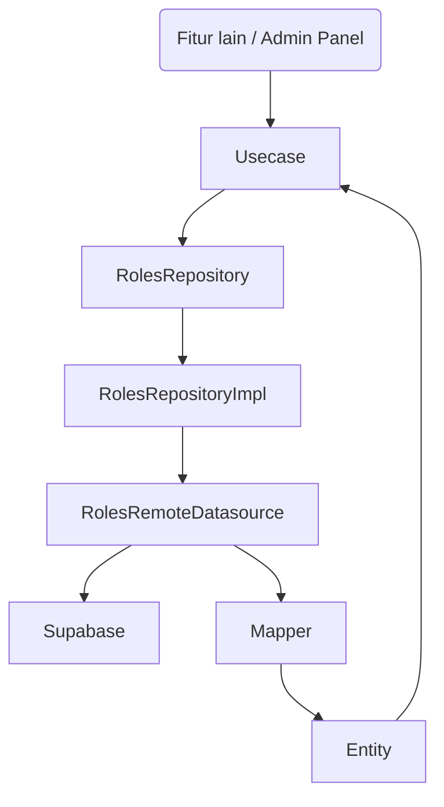

---

id: clean-architecture
title: Clean Architecture & Flow Roles
sidebar\_label: Clean Architecture
----------------------------------

# Clean Architecture & Flow Sistem Roles

Dokumentasi ini menjelaskan secara lengkap bagaimana arsitektur sistem roles di aplikasi HIMTIKA diatur agar **modular, mudah dikembangkan, dan mudah dipahami oleh generasi developer berikutnya**.

Arsitektur yang digunakan adalah **Clean Architecture dengan penyesuaian pragmatis**.

---

## 🔍 Mengapa Clean Architecture?

| Alasan                    | Manfaat                                                                     |
| ------------------------- | --------------------------------------------------------------------------- |
| **Separation of Concern** | Memisahkan logika aplikasi dari detail teknis seperti database atau UI.     |
| **Scalable & Reusable**   | Fitur baru bisa dibuat tanpa mengganggu fitur lain.                         |
| **Testable**              | Masing-masing bagian mudah di-test terpisah (unit test / integration test). |
| **Maintainable**          | Developer baru mudah memahami alur dan struktur kode.                       |

---

## 🏗️ Layer dalam Sistem Roles

| Layer            | Isi                                          | Contoh                               |
| ---------------- | -------------------------------------------- | ------------------------------------ |
| **Presentation** | UI (Bloc, Widget) dan State Management       | `roles_bloc.dart`                    |
| **Domain**       | Logika aplikasi murni (entity & usecase)     | `Role`, `GetUserPermissionsUseCase`  |
| **Data**         | Implementasi teknis: Supabase, model, mapper | `RolesRemoteDatasource`, `RoleModel` |
| **Application**  | Helper agar fitur lain mudah pakai roles     | `RolesController`                    |

---

## 🗃️ Struktur Folder `features/roles/`

```plaintext
roles/
├── data/
│   ├── datasources/          <-- Koneksi ke Supabase
│   │   └── roles_remote_datasource.dart
│   ├── models/               <-- Representasi data dari Supabase
│   │   └── role_model.dart
│   ├── mappers/              <-- Konversi Model <-> Entity
│   │   └── role_mapper.dart
│   └── repositories/         <-- Implementasi RolesRepository
│       └── roles_repository_impl.dart
├── domain/
│   ├── entities/             <-- Definisi Role, Permission, UserRole
│   │   └── role.dart, permission.dart, user_role.dart
│   ├── repositories/         <-- Interface abstrak RolesRepository
│   │   └── roles_repository.dart
│   └── usecases/             <-- Business logic
│       └── get_user_permissions.dart, assign_role.dart, revoke_role.dart
├── presentation/
│   └── bloc/                 <-- State management (Bloc Admin Panel)
│       └── roles_bloc.dart
├── application/
│   └── roles_controller.dart <-- Helper agar fitur lain bisa cek hak akses dengan mudah
```

---

## 🔄 Flow Hak Akses

### Diagram Alur Hak Akses



### Penjelasan Alur:

1. **UI Layer** (Bloc / Controller) memanggil **Usecase**
2. **Usecase** memanggil abstrak `RolesRepository`
3. **RolesRepositoryImpl** melakukan proses:

   * Ambil data dari `RolesRemoteDatasource`
   * Konversi Model → Entity dengan `Mapper`
4. Hasil berupa **Entity** dikembalikan ke **Usecase**, lalu ke **UI**

---

## 🔍 Detail Peran File

### 1. `roles_remote_datasource.dart`

* Bertanggung jawab untuk komunikasi dengan **Supabase**
* Menggunakan query / RPC untuk ambil data, assign, revoke role.

### 2. `role_model.dart`, `permission_model.dart`, `user_role_model.dart`

* Data Transfer Object (DTO) dari database Supabase.
* Dipakai di layer data, tidak langsung ke UI.

### 3. `role_mapper.dart`, `permission_mapper.dart`, `user_role_mapper.dart`

* Mengubah `Model` ↔ `Entity`
* Memastikan domain logic tidak terkontaminasi detail database.

### 4. `roles_repository_impl.dart`

* Implementasi konkrit dari `RolesRepository`
* Berisi logika transformasi Model ke Entity dengan Mapper.

### 5. `roles_repository.dart`

* **Interface abstrak**, agar usecase tidak tergantung pada implementasi tertentu.

### 6. `get_user_permissions.dart`, `assign_role.dart`, `revoke_role.dart`

* Usecase untuk menjalankan logika bisnis
* Dapat dipanggil oleh fitur lain / UI.

### 7. `roles_bloc.dart`

* State management untuk halaman Admin Panel.
* Meng-handle event seperti `AssignRole`, `RevokeRole`, `LoadPermissions`

### 8. `roles_controller.dart`

* Digunakan di fitur lain seperti **Forum, Kalender, dsb**.
* Contoh penggunaan:

```dart
final rolesController = RolesController(getUserPermissions);

if (await rolesController.can(userId, 'forum', 'edit')) {
   // izinkan edit post
}
```

---

## 🚀 Contoh Penggunaan di Fitur Lain

```dart
final canDelete = await rolesController.can(
  userId,
  'forum',
  'delete',
);

if (canDelete) {
   // tampilkan tombol hapus post
}
```

---

## 📃 Ringkasan

| Layer            | Fokus                                                |
| ---------------- | ---------------------------------------------------- |
| **Data**         | Koneksi database, mapping data                       |
| **Domain**       | Logika bisnis murni                                  |
| **Presentation** | UI & State Management                                |
| **Application**  | Helper agar fitur lain bisa akses roles dengan mudah |

Dengan struktur ini, developer baru bisa **mudah memahami, mengembangkan, dan menjaga konsistensi kode**.

---

## 🎓 Untuk Generasi Developer HIMTIKA Berikutnya

* Selalu ikuti struktur ini jika membuat fitur baru.
* Jangan langsung akses database dari UI, gunakan **Usecase**.
* Jika ingin cek hak akses di fitur lain, gunakan **RolesController**.

---

## 🔍 Lanjutkan ke:

* [Data Layer Documentation](./data-layer.md)
* [Domain Layer Documentation](./domain-layer.md)
* [Testing Roles](./testing.md)